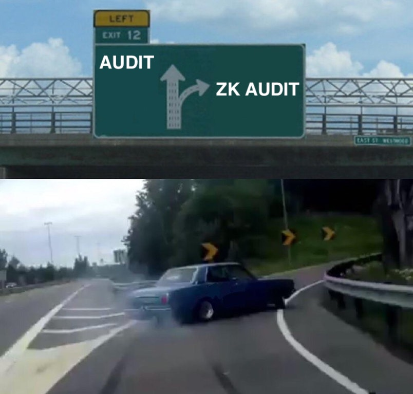

# ZK Audit Roadmap - Underconstruction



# Content table

1. [Understand the basics of zero-knowledge](#1-understand-the-basics-of-zero-knowledge)
2. [Learn how to create circuit](#2-learn-how-to-create-circuit)
3. [Know ZK common vulnerabilities](#3-know-zk-common-vulnerabilities)
4. [Mastering audits](#4-mastering-zk-audits)
5. [Reference List](#5-reference-list)

---

# 1. Understand the basics of zero-knowledge

## Make ZK classes:

- [https://zk-learning.org/](https://zk-learning.org/) - MOOC  - 17th Jan 2023 - 09th May 2023
- [https://zeroknowledge.fm/](https://zeroknowledge.fm/) - Whiteboard Sessions

## Buildl.ing SNARKs

Type of proofs:

- Optmismtic: Fraud Proofs
- ZK: Validity Proofs

### Types of setup in ZK

There are several types of setup used in zero-knowledge proofs (ZKP), including:

1. Common Reference String (CRS) setup: This type of setup is used in ZKP systems that rely on a common reference string shared between the prover and verifier. The common reference string is typically generated by a trusted third party and contains the necessary parameters for the proof.
2. Public Parameters setup: This type of setup is used in ZKP systems that rely on a set of publicly available parameters, rather than a common reference string shared between the prover and verifier. The public parameters are typically generated by a trusted third party and are used to generate the proof.
3. Publicly Verifiable setup: This type of setup is used in ZKP systems that rely on a publicly verifiable setup. In this case, the prover generates a proof that can be verified by anyone, without the need for a common reference string or public parameters.
4. Non-Interactive setup: This type of setup is used in ZKP systems that rely on a non-interactive proof, meaning that the prover and verifier do not need to communicate with each other during the proof generation process.
5. Interactive setup: This type of setup is used in ZKP systems that rely on an interactive proof, meaning that the prover and verifier need to communicate with each other during the proof generation process.

Each type of setup has its own advantages and disadvantages, and the appropriate setup will depend on the specific use case and the requirements of the system. Some types of setup are more efficient and secure than others, and some are more suited for specific types of

### Overview of ZK setup process 🐦

1. For ZK-Snarks, the setup process is divided into 2 phases:
    
    ### Trusted Setup Phase
    
    1. Generate a common reference string (CRS)
    
    ### Key Generation Phase
    
    1. A public/private keypair for the prover
        1. The private key is kept in secret and is used to generate the proof
        2. The public key is shared with verifier to verify the proof
        
        > The prover uses the private key along with the input values of the statement to be proven, and the CRS to generate the proof.
        > 
    2. A proving and verifying key for the verifier.
        1. The proving key is used by the prover to generate the proof
        2. The verifying key is used by the verifier to check the proof
        
        > The verifier uses the verifying key along with the proof, the input values of the statement, and the CRS to verify the proof
        > 

1. For zk-STARKs, the setup process is one-time process:
    1. Generate CRS that includes a commitment to the polynomial and the values of the evaluation of this polynomial at specific points.
    2. Then CRS is used by the prover and verifier to generate and verify the proof.

## Protocols

### ZCash Architecture

### Mina Protocol Architecture

### Starknet Architecture

# 2. Learn how to create circuit

**Useful links**

- Circom Tic-Tac-Toe -
- MOOC implementations - https://github.com/rdi-berkeley/zkp-course-lecture3-code

## Geting into ZK

1. Read Tornado Cash Whitepaper - 
2. Zk Battleship - Complete project: circtuits + contracts - [https://kunalm.xyz/posts/zksnark-battleship.html](https://kunalm.xyz/posts/zksnark-battleship.html)
3. Learn about Mina Protocol is the easies one -
4. Aleo Leo examples - developer.aleo.org/leo/examples
5. Look at Starware Cairo - 

## Hands-on

1. Writing own circuit, pick one and create some examples
    1. Circom + SnarkyJS - [https://docs.circom.io/](https://docs.circom.io/)
    2. Noir
    3. Leo
    4. ZoKrates - [https://zokrates.github.io/](https://zokrates.github.io/)
    5. Bellman (Rust)
    6. Arkworks (Rust) - https://github.com/arkworks-rs/r1cs-tutorial/
2. Learn about zk-VMs: RISC Zero

## Circom

Circom is a HDL for R1CS, where:

- wires: R1CS variables
- gates: R1CS constraints

## Example of circuit C

```jsx
const circom = require("circom");

// Define the circuit
const circuit = await circom(`
    template A() {
        signal private input a;
        signal private input b;
        signal output c;

        c <== a > b;
    }
`);

// Create a circuit instance
const circuitInstance = circuit.createCircuit("A");

// Set input values
circuitInstance.setSignal("a", 8);
circuitInstance.setSignal("b", 5);

// Evaluate the circuit
circuitInstance.execute();

// Get the output value
console.log(circuitInstance.getSignal("c")); // Output: true
```

## Proof systems

1. Groth`16 - proof 200 bytes - verifier time 3ms - trusted setup per circuit
2. Plonk/Marlin - proof 400 bytes - verifier time 6 ms  - trusted setup universal (one-time)
3. STARK - proof 80kb - verifier time 10ms - no trusted setup (not snark)
4. Bulletproofs - proof 1.5kb - verifier time 1.5s - no trusted setup

## Execution path of SNARK

(Circom, ZoKrates, Cairo, Leo, Noir)  ⇒ converted to SNARK friendly format ⇒ (R1CS, AIR, Plonk-CG, PIL) ⇒ generate the parameters (Sp,Sv) ⇒ Send it to prover and verifier

**Overview of ZK**

Program Logic → Computation (sign transaction, execute) → circuit definition (polynomials) → Arithmetization ( turn tree into a polynomial) → Non-interactive proof → integration

# 3. Know ZK common vulnerabilities

**Useful links**

- [Common Zero-Knowledge Proof Vulnerabilities - D-Squared](https://www.youtube.com/watch?v=1RQSwj8h8rM) (Video)

# 4. Mastering  ZK-Audits

# 5. Reference List

- Awesome Circom Repo - https://github.com/iamsahu/awesome-circom
    - Repository with libraries, dev tools, projects, talks and workshop
- [**HickupHH3**]([https://twitter.com/HickupH](https://twitter.com/HickupH)) ZK Write-ups - [https://www.notion.so/ZK-Write-ups-66d51e0dc8d245a58d88320afef78279#650a02a9bade42cca46867fbf85237da](https://www.notion.so/66d51e0dc8d245a58d88320afef78279)

# Contribute

Propose link additions by visiting README.md and click the "pen" icon in the top right corner. Make changes to the file and follow the instructions to create a pull request.